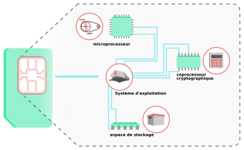
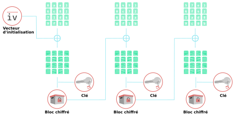
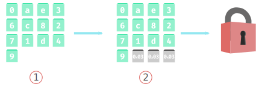

L'authentification par certificats x.509 et smartcard
-----------------------------------------------------

## Introduction

Depuis toujours, l'authentification sur des systèmes informatique est
principalement régie par l'utilisation du couple identifiant / mot de passe.
C'est pourtant un facteur d'identification peu fiables : utilisation du même mot
de passe pour plusieurs - voir tous les - services, mot de passe faible, progrès
technique rendant leur cassage plus efficaces etc. Dans un communiqué de presse
du W3C et de l'Alliance FIDO, "les mots de passe volés, faibles ou par défaut
sont à l'origine de 81% des atteintes à la protection des données".

Il existe des solution pour pallier cette faiblesse, avec notamment
l'introduction d'un ou plusieurs autres facteurs d'authentification (TOTP, SMS
etc.), ou les gestionnaires de mots de passe (keepass, LastPass ...).

L'authentification par certificats semble être une alternative
intéressante au traditionnel mot de passe. Nous allons dans ce mémoire étudier
son fonctionnement, parler de son intégration dans GNU/Linux, parler de sa mise
en œuvre et tenter d'exposer ses limites.

## La norme X.509

La norme X.509 régissant les formats les format pour les certificats à clé
publique. Elle est définie par l'Union Internationale des Télécommunications et
établie :

 - Le **format de certificat**
 - La **liste de révocation** des certificats
 - leurs **attributs**
 - un **algorithme de validation de chemin de certificats**

Contrairement à OpenPGP qui repose sur une toile de confiance, X.509 repose sur
les autorités de certifications : un tiers de confiance délivre les certificats
et fournit les moyens de les vérifier.

Les certificats X.509 sont donc composé de deux éléments : une partie publique
et une partie privée. Ces certificats peuvent assurer plusieurs rôles

### PKI - Infrastructure à clefs publiques

Une infrastructure à clefs publiques est un ensemble d'éléments, qu'ils soient
humain, matériels ou logiciels, destinés à gérer les clefs publiques des
utilisateurs d'un système.

Cette infrastructure est utilisée pour créer, gérer, distribuer et révoquer des
certificats

#### La PKI elle va te crypter l'Internet du digital

Sur Internet, les différentes autorités de certifications assurent les rôles de
PKI : Elle fournissent l'infrastructure pour gérer les certificats permettant
le fonctionnement du chiffrement TLS.

## Une SmartCard?

Maintenant que nous avons parlé de la norme X.509, nous allons parler de notre
**startcard**. D'après Wikipedia ([source](l_sc-wiki)) :

> Une carte à puce est une carte en matière plastique, voire en papier ou en
> carton, de quelques centimètres de côté et moins d'un millimètre d'épaisseur,
> portant au moins un circuit intégré capable de contenir de l'information. Le
> circuit intégré (la puce) peut contenir un microprocesseur capable de traiter
> cette information, ou être limité à des circuits de mémoire non volatile et,
> éventuellement, un composant de sécurité (carte mémoire).

Vous utilisez tous les jours une SmartCard : votre carte SIM, votre carte
bancaire...

Les smartcards qui nous intéressent ici contiennent un espace de stockage, un
microprocesseur et un coprocesseur pour accélérer les opérations
cryptographiques.



Comme vous pouvez le voir, il n'y a pas de connexion directe entre les contacts
et la mémoire. Pour des raisons évidente de sécurité, tout passe par le système
d'exploitation de la carte. Il en existe une multitude (JavaCard Operating
System, MULTOS, OpenPGP Card, Gnuk etc.)

### Création, stockage et utilisation de certificats

Dans le cas qui nous intéresse, la carte à puce permet de stocker le certificat
et de l'utiliser. Lors de son utilisation, un code PIN sera demandé, le
certificat contenu pourra alors être utilisé pour s'authentifier, signer ou
chiffrer.

Certaines Smartcard permettent la génération de certificats.

### Le Web plus accessible aux authentifications par certificats

Aujourd'hui, l'un des principaux défauts de l'authentification par certificats,
c'est qu'elle n'est pas déployée largement : seul un petit nombre de services
l'utilisent.

Cependant, supporté par le constat que les mots de passe perdent
en efficacité, le standard WebAuthn (pour Web Authentication) a récemment été
créé et publiée par le W3C. Ce standard définit une API destinée aux
navigateurs, aux applications web et aux autres plateformes nécessitant une
authentification forte basée sur clés publiques.

Les grands du Web ont déjà ont déjà mit en place le support de WebAuthn sur
leurs outils : Windows 10, Android, Google Chrome, Mozilla Firefox,
Microsoft Edge et Safari. L'apparition de ce standard va sans aucun doute
encourager une adoption plus large de ce type d'authentification.

## Attaque sur les smartcard

### Attaques par canal auxiliaire

Les attaques par canal auxiliaire regroupe les attaques qui tentent d'exploiter
des failles sur l'implémentation des procédures de sécurité plutôt que sur les
procédures elles-mêmes. Voici une liste de types d'attaques par canal
auxiliaire sur lesquels on va s'attarder car elles touchent les smartcard :

#### Attaque par sondage

Particulièrement invasive, elle consiste à détériorer suffisamment une puce pour
avoir un accès physique aux bus et y lire les bits qui y passent. Il est à noter
que cette attaque est très difficile à mettre en place car elle nécessite du
matériel de pointe (oscilloscope très précis,
chronométrage du passage des bits...), de la rigueur et de la précision sur la
détérioration de la puce, etc.

#### Analyse de consommation

En fonction des opérations résolues par un processeur, sa consommation en
énergie diffère. En étudiant les variations d'énergie utilisée par un lecteur de
cartes, il est possible de trouver des indices sur la clé privée, sur un
échantillon suffisant. Aujourd'hui, cette attaque peut être aisément
contrecarrée en apposant du bruit sur le circuit ou en le blindant.

#### Analyse d'émanations électromagnétiques

Semblable à l'Analyse de consommation, à ceci prêt qu'on ne s'attache pas, cette
fois ci à, l'énergie consommée mais au rayonnement électromagnétique émis par un
appareil. A l'instar de la consommation en énergie, le rayonnement n'est pas
le même en fonction des opérations exécutées par le terminal. L'étude du
rayonnement thermique peut s'apparenter à une analyse d'émanations
électromagnétiques.

#### Attaque par faute

Le principe ici est de provoquer des erreurs pour que le système réagisse de
manière inhabituelle sur les opérations de chiffrement et laisse des indices
sur la clé de chiffrement.

#### Attaque temporelle

Le temps que met un algorithme à s'exécuter donne parfois des indices sur la
constitution d'une clé entrée en paramètre dans cet algorithme, comme le nombre
de bits à 1. A elle seule, cette attaque ne donne pas beaucoup d'informations,
mais elle peut être combinée avec d'autres attaques pour en augmenter son
efficacité.

### Attaques sur les PKI

Même si elle ne touchent pas directement les smartcard, Il est intéressant de
parler des attaque sur les infrastructures à clé publiques.

#### Collision MD5

Le MD5 (pour Message Digest 5) est un algorithme de hachage cryptographique
permettant d'obtenir l'empreinte d'un fichier / d'une chaine de caractères. Elle
a été inventée par Ronald Rivets en 1991 pour succéder à MD4.

Il doit être considéré comme obsolète depuis 1996, années de découverte d'une
faille dans l'algorithme ouvrant la voie à des collisions. En 2004 une équipe de
chercheurs chinois menés par la mathématicienne Wang Xiaoyun [démontre la
faisabilité][l_md5_2005] d'une collision complète. Mais cette attaque n'est pas
encore suffisamment sophistiquée pour être utilisée sur un cas concret. Wang,
Lenstra et de Wegner feront la [démonstration de leur attaque][l_md5_2006] sur
deux certificats X.509 différents ayant la même signature MD5 en 2006.

[l_md5_2005]:https://eprint.iacr.org/2004/199.pdf
[l_md5_2006]:https://www.win.tue.nl/~bdeweger/CollidingCertificates/

##### Attaque par collision

Une attaque par collision est menée sur une fonction de hashage cryptographique
afin trouver deux entrées différentes donnant lieux au même résultat. Comme la
plupart des fonctions de signature électronique le font sur le hash d'un
document plutôt que sur le document lui-même. Ainsi s'il est possible de
produire deux documents avec le même hash, leurs signatures sera strictement
la même. Il suffit alors d'envoyer à l'autorité de certification le document
légitime et copier la signature obtenue sur le document frauduleux.

##### Attaque par collision avec préfixe choisi

Dans le cadre de certificats, les choses se compliquent un peu : c'est
l'autorité de certification qui génère le certificat en fonction des
informations contenues dans le CSR. L'attaquant doit alors manipuler les données
contenues dans le CSR qu'il envoie et y intégrer des blocs de collision pour
annuler les différences entre les hashes du certificats obtenu et celui forgé.
Il va jouer sur le préfixe du CSR, d'où le nom de l'attaque.

Ce type d'attaque n'est cependant pas aisé, l'attaquant devra anticiper
certaines informations qui seront intégrées dans le certificat produit par
l'autorité. Certaines pourront être influencées comme le champ CN, d'autres
récupérées sur d'autre certificats signés par la même autorité (le contenu des
champs *issuer* par exemple) et enfin d'autres devront être
"devinées" [^n_devinees]  - numéro de série du certificat et date d'expiration -

[Une telle attaque a été démontrée][l_md5_2008] en décembre 2008 par une équipe
de chercheurs menée par Sotirov et Stevens. Ils ont ainsi pu obtenir un
certificat à même de signer n'importe quel autres certificats et reconnu par les
principaux navigateurs de l'époque.

Une technique similaire a été utilisée par le malware *Flame* découvert en 2012.
Il usurpait une signature de code Microsoft pour se propager au travers de
Windows Update.

[l_md5_2008]:https://www.win.tue.nl/hashclash/rogue-ca/
[^n_devinees]:Prédites serait plus adapté, dans l'attaque menée par Sotirov et
Stevens, l'équipe de chercheurs a réussi prédire ces deux éléments en étudiant le
fonctionnement de l'autorité de certification utilisée.

### Attaque par oracle de padding

Ce type d'attaque a été mené avec succès sur différents périphériques
cryptographiques par un équipe de recherche internationale. Leurs travaux a
donne lieu ã une publication en avril 2012.

Ils on pu ainsi extraire les clefs privées de la plupart des périphériques
disponibles sur le marché quel que soit leurs marques.

La première démonstration pratique de cette attaque a été faite par Daniel
Bleichenbacher alors chercheur en cryptographie chez *Bell Laboratories*

#### fonctionnement de cette attaque

##### Fonctionnement du chiffrement par bloc

Avant de rentrer plus en détail dans le fonctionnement de l'attaque par oracle
de padding, il est nécessaire d'expliquer le fonctionnement du chiffrement par
bloc. Il exxiste une multitude de chiffrement par bloc, nous resterons sur le
mode CBC *Cipher Block Chaining*.



Pour éviter l'apparition de motifs dans le bloc chiffré qui pourrait faciliter
la création de "dictionnaire de code", le mode *CBC* utilise le précédent bloc
chiffré pour réaliser une opération booléenne avec le bloc actuel en clair avant
de le chiffrer. Pour le premier bloc à envoyer, *CBC* utilise un vecteur
d'initialisation.

Contrairement au chiffrement de flux, le chiffrement par bloc nécessite une
taille de donnée définie en entrée. Si les données sont trop importante, il faut
les découper, si elle sont plus petite on utilisera la technique du padding.

```
txt_dechiffre[n] = dechiffrer(c_block[n]) ⊕ c_block[n-1]
```

##### Le padding



Dans notre exemple, notre bloc doit faire 128 bits mais les données ne
représente que 104 bits [1]. Nous allons donc rajouter trois octets avec pour
valeur hexadécimale `0x03` qui représente le nombre d'octets manquant [2].

##### L'attaque par oracle de padding

Une **oracle de padding** est un mechanisme prenant un bloc chiffré en entrée,
de déchiffre et averti l'utilisateur si le padding est correct ou non.

Le chiffrement par bloc en mode *CBC* a un énorme défaut : l'intégrité des
messages n'est pas vérifiée. Du coup un attaquant peut modifier le résultat
de `txt_dechiffre[n]` en modifiant `c_block[n-1]`, ou tout simplement en le
forgeant à notre convenance.

Prenons `X` comme bloc de chiffrement forgé pour l'occasion, et `c_block[a]`
bloc de chiffrement à attaquer, nous pouvons écrire :

```
t_clair_hack[a] = dechiffrer(c_block[n]) ⊕ X
```

Nous savons aussi que :

```
c_block[a] = chiffrer(txt_clair[a] ⊕ c_block[a-1])
```

Donc on peut écrire :

```
t_clair_hack = dechiffrer(chiffrer(txt_clair[a] ⊕ c_block[a-1])) ⊕ X
# et en simplifiant
t_clair_hack = txt_clair[a] ⊕ c_block[a-1] ⊕ X
```

Cette équation se compose de deux éléments que nous avons en notre possession :
`X` notre bloc forgé et `c_block[a-1]` notre avant-dernier bloc, et deux
éléments inconnus : `t_clair_hack` le résultat en clair de la manipulation de
notre attaque et `txt_clair[a]` le résultat du déchiffrement de `c_block[a]`.

Il n'est plus question ici de chiffrement, mais de simples opérations booléenne.

Comme nous avons accès à une **oracle de padding** nous n'avons qu'a tester
toutes les valeurs du dernier octet de `X` jusqu'à obtenir un padding correct
(`0x01`). Dans le cadre de notre block de 16 octets :

```
0x01 = txt_clair[a][15] ⊕ c_block[a-1][15] ⊕ X[15]
```

Il ne nous reste plus qu'une inconnue, nous pouvons résoudre l'équation.

Il suffit de procéder ainsi pour les 16 octets de notre bloc pour le déchiffrer
en entier, et ainsi de suite...

##### Et son utilisation contre les smartcard

C'est bien entendu une version simplifiée de l'attaque par padding oracle, mais
elle permet de comprendre son fonctionnement. Elle fut au centre des travaux de
recherche menés par Romain Bardou, Riccardo Focardi, Yusuke Kawamoto, Lorenzo
Simionato, Graham Steel, et al. donnant lieu à une publication. Ces travaux
permirent, en 2012, **l'extraction des clés privées** de beaucoup de
périphériques de cryptographie (PKCS#11) de marques différentes. Les chercheurs
ont par ailleurs largement améliorer les algorithmes de Bleichenbacher pour
accélérer sensiblement les performances, surtout sur les appareils peu puissant
comme les smartcards.

## Conclusion

## Bibliographie

Stéphane Bortzmeyer *[RFC 5280: Internet X.509 Public Key Infrastructure
Certificate and Certificate Revocation List (CRL)
Profile](https://www.bortzmeyer.org/5280.html)*

Ivan Ristić *[BulletProof SSL and TLS](https://www.feistyduck.com/books/bulletproof-ssl-and-tls)*

Pixis *[Padding oracle](https://beta.hackndo.com/padding-oracle/)*

Romain Bardou, Riccardo Focardi, Yusuke Kawamoto, Lorenzo Simionato, Graham Steel, et al..
*Efficient Padding Oracle Attacks on Cryptographic Hardware.* [Research Report] RR-7944, 2012,
pp.19. <hal-00691958v2>

Marc Zaffagni *[CNETfrance.fr : Vers la fin des mots de passe ? WebAuthn est
désormais un standard du web](https://www.cnetfrance.fr/news/vers-la-fin-des-mots-de-passe-webauthn-est-desormais-un-standard-du-web-39881531.htm)*

W3C *[Web Authentication: An API for accessing Public Key Credentials](https://www.w3.org/TR/webauthn)*

Wikipedia *[Attaque de collisions](https://fr.wikipedia.org/wiki/Attaque_de_collisions)*,
*[Attaque par canal auxiliaire](https://fr.wikipedia.org/wiki/Attaque_par_canal_auxiliaire)*
